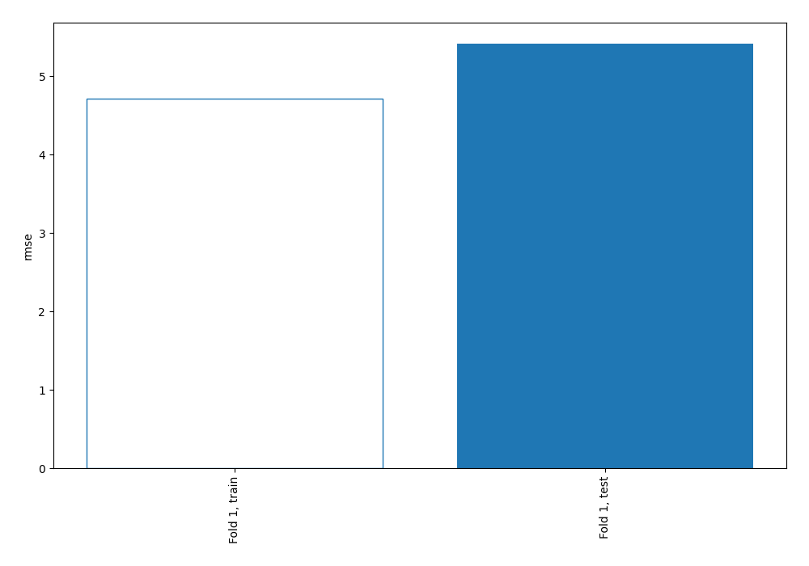
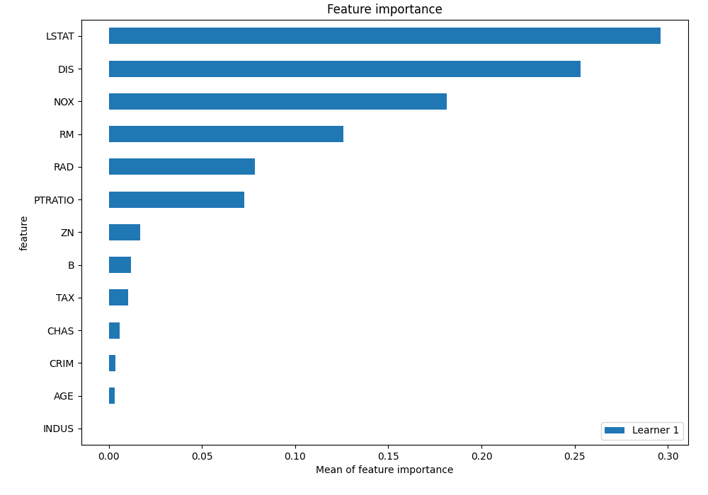
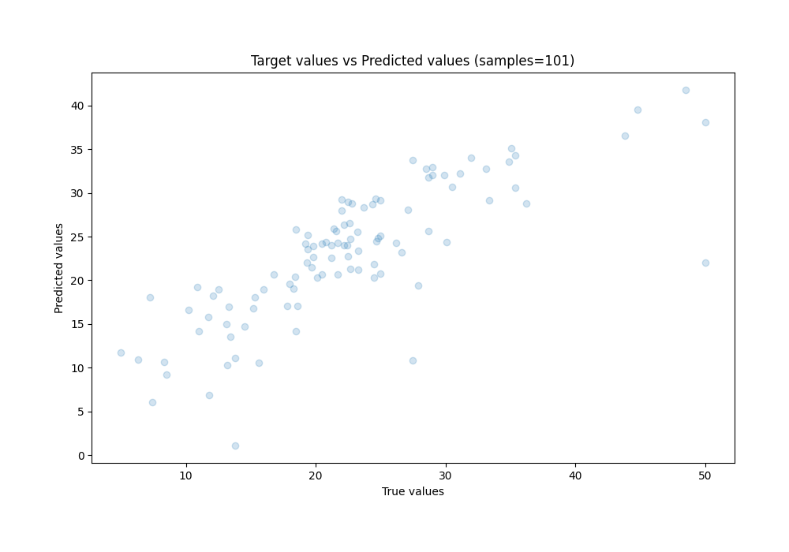
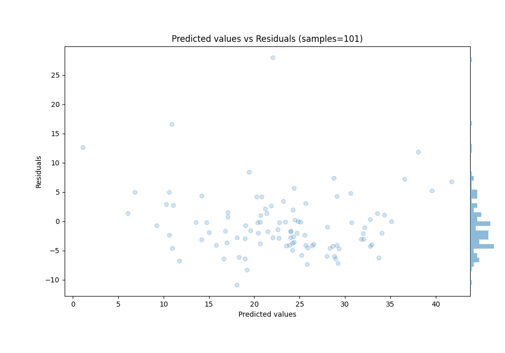
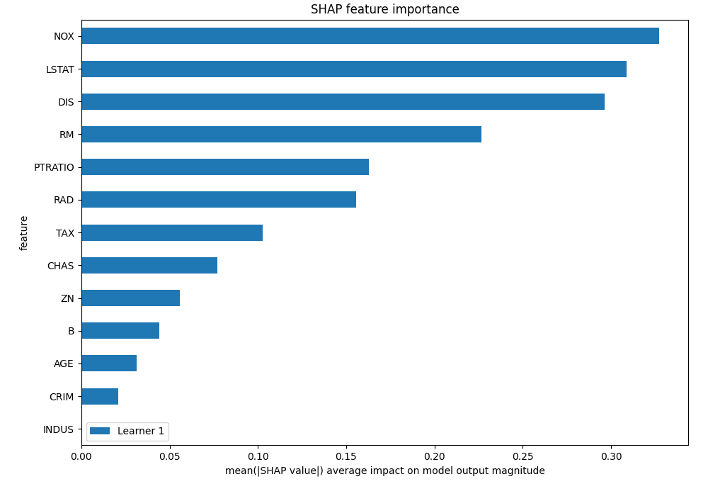
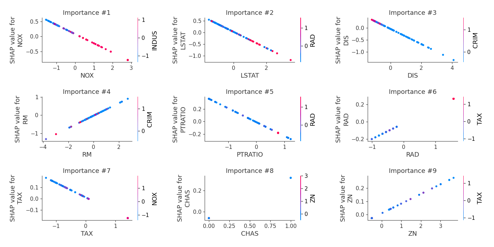
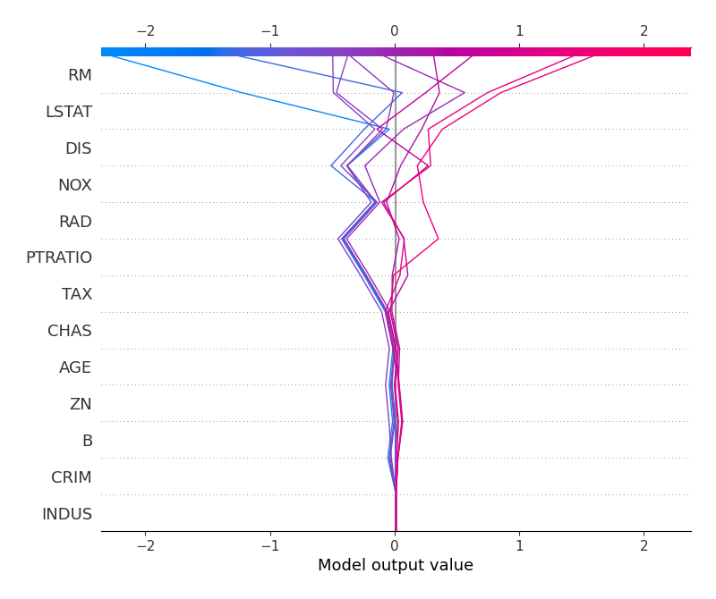
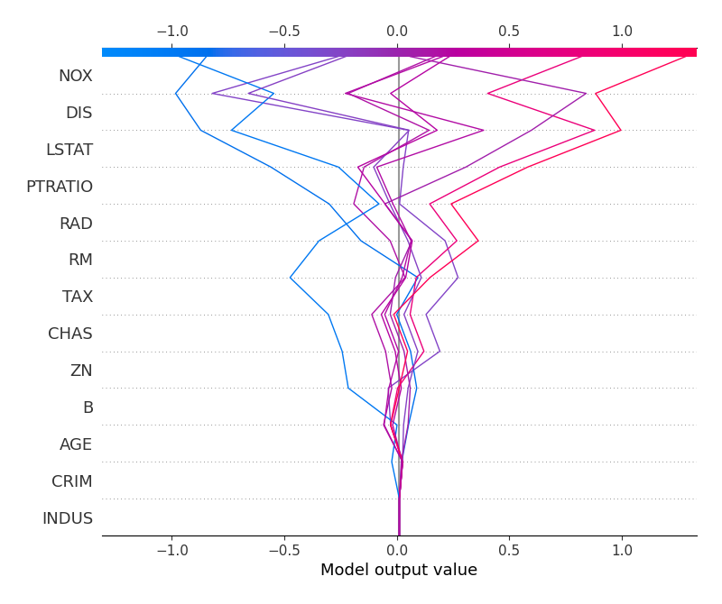

# Summary of 3_Linear

[<< Go back](../README.md)

## Linear Regression (Linear)
- **n_jobs**: -1
- **explain_level**: 2

## Validation
 - **validation_type**: split
 - **train_ratio**: 0.75
 - **shuffle**: True

## Optimized metric
rmse

## Training time

2.0 seconds

### Metric details:
| Metric   |     Score |
|:---------|----------:|
| MAE      |  3.90652  |
| MSE      | 29.3195   |
| RMSE     |  5.41475  |
| R2       |  0.638982 |
| MAPE     |  0.210273 |

## Learning curves

## Coefficients
| feature   |    Learner_1 |
|:----------|-------------:|
| CHAS      |  0.384228    |
| RM        |  0.340198    |
| RAD       |  0.181854    |
| B         |  0.0876072   |
| ZN        |  0.0731394   |
| AGE       |  0.0354793   |
| INDUS     | -0.000105116 |
| intercept | -0.0304339   |
| CRIM      | -0.0344818   |
| TAX       | -0.127702    |
| PTRATIO   | -0.218451    |
| NOX       | -0.307692    |
| DIS       | -0.313611    |
| LSTAT     | -0.349021    |

## Permutation-based Importance

## True vs Predicted

## Predicted vs Residuals

## SHAP Importance

## SHAP Dependence plots

### Dependence (Fold 1)

## SHAP Decision plots

### Top-10 Worst decisions (Fold 1)

### Top-10 Best decisions (Fold 1)

[<< Go back](../README.md)
