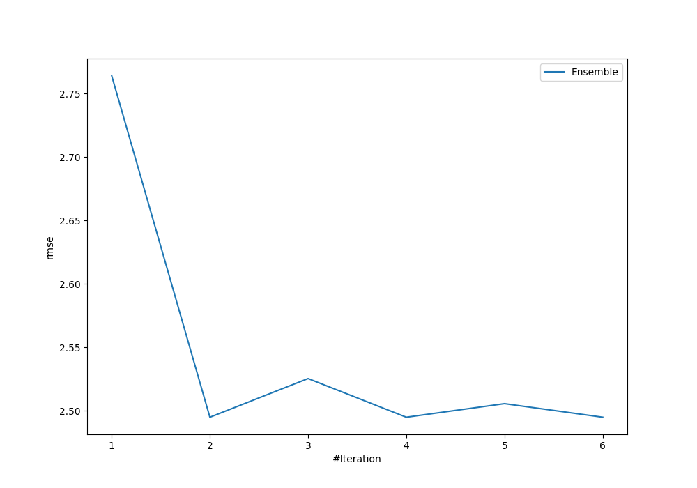
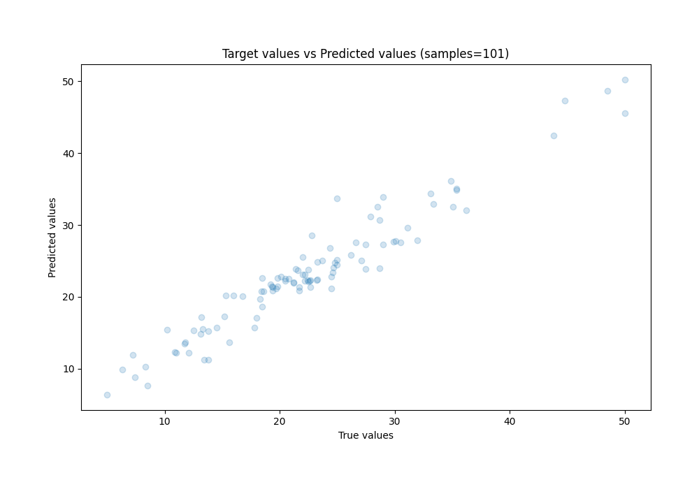
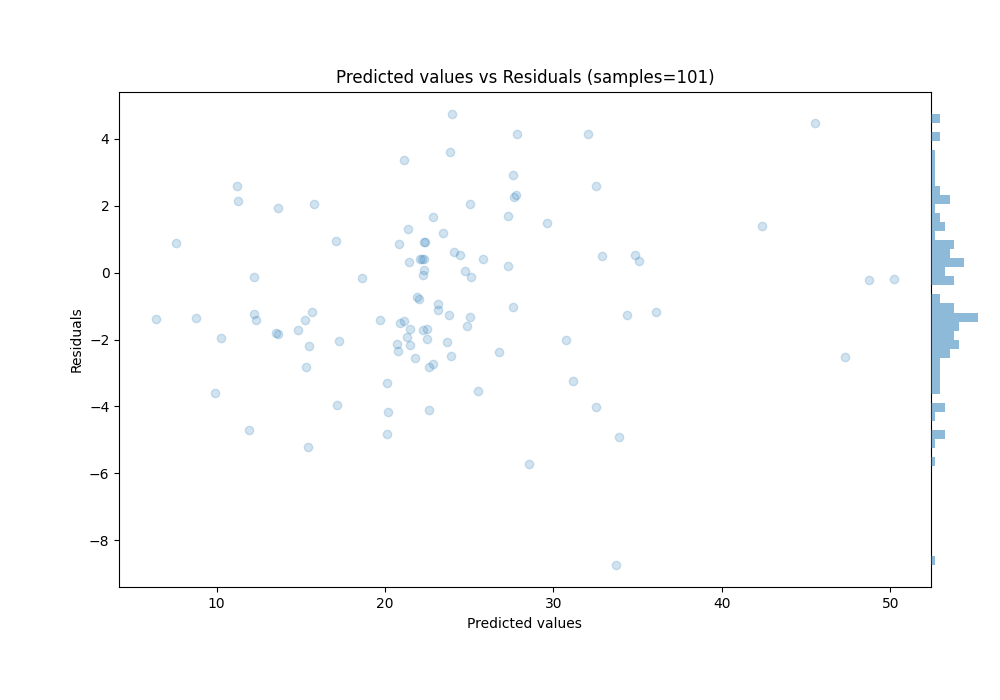

# Summary of Ensemble

[<< Go back](../README.md)

## Ensemble structure
| Model                   |   Weight |
|:------------------------|---------:|
| 4_Default_Xgboost       |        1 |
| 5_Default_NeuralNetwork |        1 |

### Metric details:
| Metric   |    Score |
|:---------|---------:|
| MAE      | 1.99494  |
| MSE      | 6.22415  |
| RMSE     | 2.49482  |
| R2       | 0.923361 |
| MAPE     | 0.110867 |

## Learning curves

## True vs Predicted

## Predicted vs Residuals

[<< Go back](../README.md)
